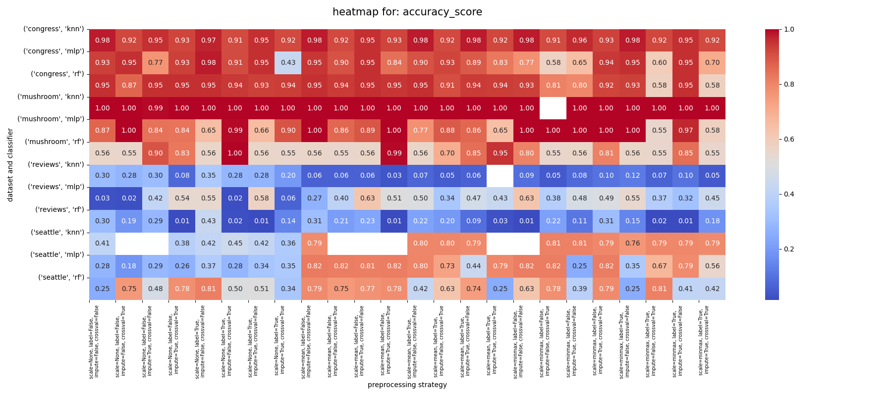
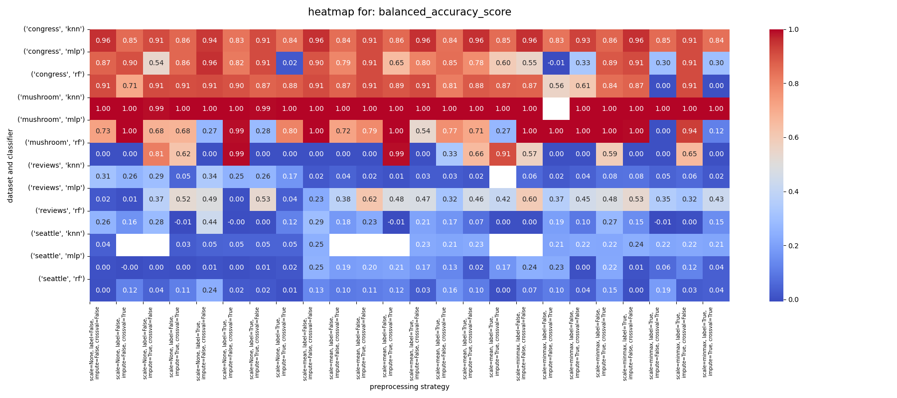
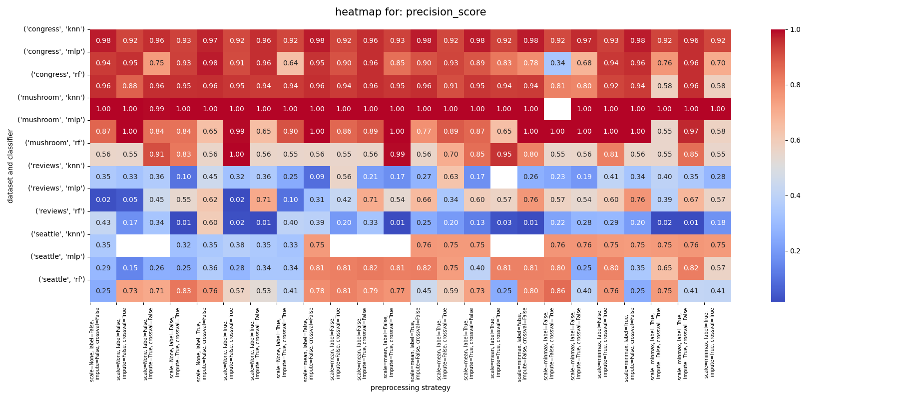
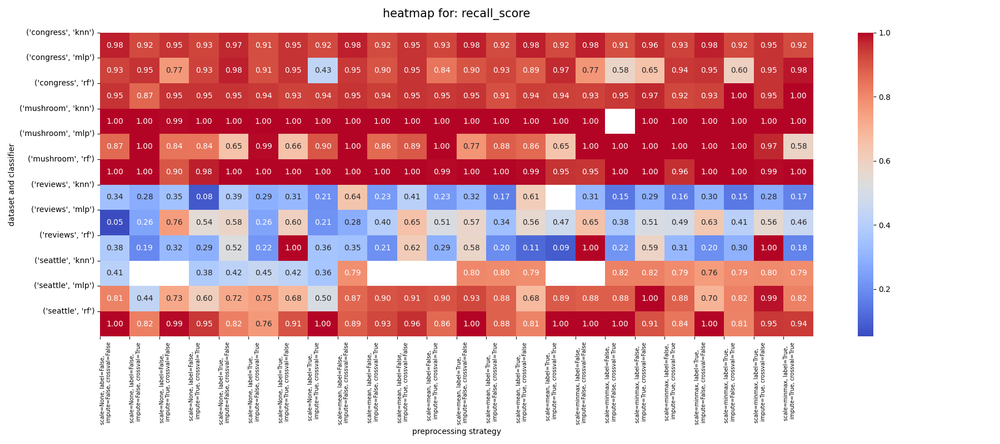
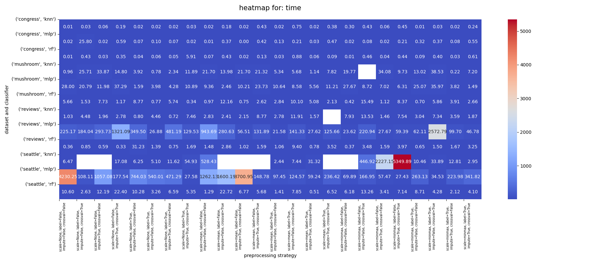

<!-- $ pandoc --read=markdown --write=latex --pdf-engine=xelatex --variable geometry:margin=20mm --variable documentclass:extarticle --variable fontsize:11pt --output=README.pdf README.md -->

```
            ______
         .-'      `-.
       .'            `.
      /                \
     ;    grid         ;`   beyond just
     |    search       |;   hyperparameter
     ;    galore       ;|   optimization
     '\               / ;
      \`.           .' /
       `.`-._____.-' .'
         / /`_____.-'
        / / /
       / / /
      / / /
     / / /
    / / /
   / / /
  / / /
 / / /
/ / /
\/_/
```

<br><br><br>

# the search

the idea is really simple: for each one of your datasets try every possible combination of preprocessing strategies, models and validation methods from a predefined set of choices. then fine-tune the hyperparameters of the best models with `sklearn.model_selection.GridSearchCV` to see if you can achieve even better results.

here's roughly how it works:

```python
COMBINATIONS = {
     "dataset": ["congress", "mushroom", "reviews", "seattle"], # dataset
     "scaling": ["mean", "minmax", None],                       # preprocessing: scaling method
     "labeling": [True, False],                                 # preprocessing: one-hot encoding or not
     "imputing": [True, False],                                 # preprocessing: impute missing values or not
     "classifier_type": ["mlp", "knn", "rf"],                   # classifier
     "cross_val": [True, False],                                # validation: cross-validation / holdout validation
}
random_combinations = list(itertools.product(*COMBINATIONS.values()))
random.shuffle(random_combinations)
```

this is equivalent to a grid search with 288 unique combinations. to speed things up we use the `multiprocessing` library and a custom signal based `@timeout((x))` decorator to limit the runtime of each configuration to `x` minutes and a custom `@benchmark` decorator to measure the runtime of each configuration. we then benchmarked the runtime of different disk I/O methods to avoid bottlenecks.

let's dive into the details of what each category means.

_classifiers:_

-   `MLP`: multilayer perceptron
-   `kNN`: k-nearest neighbors
-   `RF`: random forest

_datasets:_

-   `congress`: congressional voting records

    _source:_ https://archive.ics.uci.edu/dataset/105/congressional+voting+records

    this dataset tracks how members of the us house of representatives voted on 16 important issues. the votes were identified by the congressional quarterly almanac (cqa) during the 98th congress, 2nd session in 1984. it shows if they voted yes ("y"), no ("n") or didn't express a clear opinion ("unknown"). the dataset also notes each representative's political party (democrat or republican). the issues covered in the dataset include things like aid for infants with disabilities, water project funding and foreign policy matters.

-   `mushroom`: secondary mushroom

    _source:_ https://archive.ics.uci.edu/dataset/848/secondary+mushroom+dataset

    the secondary mushroom dataset is inspired by the [original mushroom dataset](https://archive.ics.uci.edu/dataset/73/mushroom) from 1987. the original dataset contains hypothetical information about mushrooms and whether they are edible or poisonous. the features include things like cap shape, cap color, gill color, stalk shape, etc. it was created in 2023 and is intended for binary classification into edible and poisonous mushrooms. it contains 61,068 instances of hypothetical mushrooms with 20 features, including variables like cap diameter, shape, surface, color, and others related to mushroom characteristics. the dataset was simulated based on the mushroom data set by j. schlimmer. the dataset was created as a product of a bachelor thesis at philipps-university marburg.

-   `reviews`: amazon reviews

    _source 1:_ https://www.kaggle.com/competitions/mse-bb-2-ss2020-mle-amazon-reviews

    _source 2:_ https://www.kaggle.com/competitions/184702-tu-ml-ws-19-amazon-commerce-reviews/

    _source 3:_ https://www.kaggle.com/code/anybodywise/yavorskyi-predict-review-authors-with-sklearn/

    the origin of this dataset isn't entirely clear. it seems to be a collection of amazon reviews, purely based on the available file names. but upon further investigation, we found out that the dataset was used in multiple viennese university courses and kaggle competitions that provide some context: this dataset originates from customer reviews on the amazon commerce website and is used for authorship identification. previous research typically focused on experiments with two to ten authors - but this adaption consists of 50 highly engaged users, each identified by a unique username, known for frequently posting reviews in these forums.

-   `seattle`: seattle crime 6

    _source:_ https://www.openml.org/search?type=data&id=41960&sort=runs&status=active

    the last dataset contains various information about criminal offences in seattle, wa. we mainly chose this dataset because of its difference in characteristics to the first one and its similarly interesting content and good presentation.

    _anomaly_: on a side note, we encountered some anomalies with the openml platform while accessing their data api. the `report_number` column was missing from the datasets we fetched via the api, but present in the datasets we manually downloaded from the website. this inconsistency could cause problems for users and should be addressed by the platform as it could lead to irreproducible results. furthermore, we found that offline datasets from openml are in binary format and need to be decoded, unlike the api versions. also, surprisingly, reading the offline datasets was slower than reading them via the api even though we expected the opposite before benchmarking the runtime. the unreliable performance of the openml api could be a concern for users who rely on it for their research.

_metrics:_

-   `time`: runtime in seconds (excluding i/o). specs: apple M2 Pro 14.2.1 23C71 with an arm64 CPU, Mac14,10 kernel version 23.2.0 and 16GB of RAM.
-   `accuracy_score`: as `sklearn.metrics.accuracy_score(y, y_pred, normalize=True)`
-   `balanced_accuracy_score`: as `sklearn.metrics.balanced_accuracy_score(y, y_pred, adjusted=True)`
-   `precision_score`: as `sklearn.metrics.precision_score(y, y_pred, average="weighted", zero_division=0, labels=np.unique(y_pred))`
-   `recall_score`: as `sklearn.metrics.recall_score(y, y_pred, average="weighted", zero_division=0, labels=np.unique(y_pred))`
-   `zero-one-loss`: as `sklearn.metrics.zero_one_loss(y, y_pred, normalize=True)`

_validation strategies:_

-   3-fold cross validation
-   holdout validation with an 80/20 split

# findings

here is an example of a single entry in the json file used to store the benchmark results:

```
...
{
    "results": [
        ...
        {
            "args": {
                "dataset": "congress",
                "scaling": "minmax",
                "labeling": "True",
                "imputing": "True",
                "classifier_type": "mlp",
                "cross_val": "True"
            },
            "classifier_config": {
                "hidden_layer_sizes": ["9", "6"],
                "activation": "tanh",
                "alpha": 7.82258e-5,
                "batch_size": "auto",
                "solver": "lbfgs",
                "learning_rate": "adaptive",
                "learning_rate_init": 0.002,
                "power_t": 0.7810684969,
                ...
                "beta_2": 0.998910637,
                "epsilon": 1.07e-8,
                "n_iter_no_change": "10",
                "max_fun": "15000"
            },
            "validation": "3-fold cross validation",
            "time": 0.019725292,
            "accuracy_score": 0.9495412844,
            "balanced_accuracy_score": 0.8946958553,
            "precision_score": 0.9495014653,
            "recall_score": 0.9495412844,
            "zero-one-loss": 0.0504587156
        },
        ...
    ]
}
```

we managed to cover 96.88% of our search space (9 of 288 runs failed).

to analyze the benchmark results, we first aggregated (`np.mean`) the performance metrics for each configuration across all datasets.











here's a summary of our findings:

-   **congress dataset**:

    the congress dataset was the easiest to work with, as all classifiers performed pretty well with respect to all metrics on this dataset, but the knn classifier had the best max. and average score across all metrics and is accordingly the best choice for this dataset. the rf classifier also performed well on this dataset, but not as well as the knn classifier. what mainly drags down the performance of the mlp and rf classifiers is the fact that there are some preprocessing combinations that led to drastically worse results than knn achieved with those some configurations. additionally, whenever knn is actually outperformed by the other two classifiers, it is only by a marginal amount, which is why mlp and rf have trouble competing for knn on this dataset.

    out of all the preprocessing configurations, the best for the congress dataset with the **knn classifier** across the board was `impute: false, cross_val: false`. the other two preprocessing parameters didn't influence the results as much.

-   **mushroom dataset**:

    the knn classifier had an almost _perfect_ score on all metrics for the mushroom dataset indifferent to all other parameters and configurations. thus, it should be the first choice for this dataset based on our initial results.

    the mlp and rf classifiers also had a perfect score with some configurations, but not as consistently as the knn classifier.

    since the mlp classifier had more perfect scores than the rf classifier across all metrics and configurations and was more consistent in its performance, it should be considered the second choice for this dataset.

    the best preprocessing configuration for the mushroom dataset with the **mlp classifier** by a wide margin was `scaling: minmax, label: false`. the other two preprocessing parameters did not have a significant impact on the performance as long as the mentioned configuration was used.

-   **reviews dataset**:

    the review dataset was in general one of the most challenging to work with. overall, all classifiers performed poorly on this dataset, with the mlp classifier showing the best performance by a wide margin. this could be due to the high dimensionality of the dataset, which makes it difficult for the knn and rf classifiers to find patterns in the data. the imbalanced nature of the dataset could also be a factor, as the classifiers may struggle to learn from the minority classes.

    the best two preprocessing configurations for the reviews dataset with the **mlp classifier** were `label: false, impute: true, cross_val: false` with `mean` scaling and `label: false, impute: false, cross_val: false` with `minmax` scaling. there were a few other configurations with an accuracy above 0.5 but most were below this threshold.

-   **seattle dataset**:

    the knn timed out on far too many configurations to be considered a viable option for this dataset, so we won't consider it further.

    when looking at the mlp and rf classifiers, they showed a contrast in recall and precision, with the rf classifier having a higher average recall and the mlp classifier having a higher average precision. this suggests that the rf classifier is better at detecting true positives, while the mlp classifier is better at avoiding false positives. but their max. values were identical so it mostly depends on both the hyperparameters, processing and the given use case.

    in terms of accuracy however, the mlp classifier performed distinctly better than the rf classifier, which suggests that it is better at correctly classifying the samples overall.

    the best preprocessing configuration for the seattle dataset with the **mlp classifier** was `scale: mean, label: false`. the other two preprocessing parameters did not influence the results as strongly when this configuration was used. however, many other configurations showed some promise, too. as long as scaling was used, no matter if `mean` or `minmax`, the models were generally performing reasonably well, more often than not.

we then continued to fine-tune the hyperparameters of the best models for each dataset to see if we could achieve even better results.

# conclusion

first of all, although we have already discussed our results and learnings from our configuration exploration in 2.2.1, we would also like to showcase the details and actual numeric results of our best models, together with the preprocessing strategies and most important/sensitive hyperparameter settings used in their training.

for the `congress` dataset, we actually had a tie between knn and rf concerning model performance, but we decided to present our results for rf here, since the settings for our final model are a little more interesting as we had to do more parameter testing to find the optimal setup. additionally, this way, we can show our chosen parameters for all three classifiers we selected.

-   `congress`: - classifier: rf - preprocessing strategies: - scaling: normal - encoding: one-hot - impute: mode - important hyperparameter settings: - n_estimators: 30 - criterion: log_loss - max_depth: 50 - min_samples_split: 2 - metrics: - accuracy: 0.97727 - balanced_accuracy: 0.96153 - precision: 0.97846 - recall: 0.97727
    <br>

-   `mushrooms`: - classifier: knn - preprocessing strategies: - scaling: minmax - encoding: labeling - impute: mode - important hyperparameter settings: - n_neighbors: 5 - weights: distance - algorithm: ball_tree - leaf_size: 1 - p: 2 - metrics: - accuracy: 0.99926 - balanced_accuracy: 0.99856 - precision: 0.99926 - recall: 0.99926
    <br>

-   `reviews`: - classifier: mlp - preprocessing strategies: - scaling: normal - encoding: one-hot - impute: mode - important hyperparameter settings: - hidden_layer_sizes: [500] - activation: logistic - learning_rate: constant - learning_rate_init: 0.001 - max_iter: 500 - metrics: - accuracy: 0.69333 - balanced_accuracy: 0.71099 - precision: 0.76454 - recall: 0.72222
    <br>

-   `seattle`:
    -   classifier: mlp
    -   preprocessing strategies:
        -   scaling: normal
        -   encoding: one-hot
        -   impute: mode
    -   important hyperparameter settings:
        -   hidden_layer_sizes: [100]
        -   activation: logistic
        -   learning_rate: constant
        -   learning_rate_init: 0.001
        -   max_iter: 100
    -   metrics:
        -   accuracy: 0.81732
        -   balanced_accuracy: 0.24673
        -   precision: 0.79985
        -   recall: 0.85731
